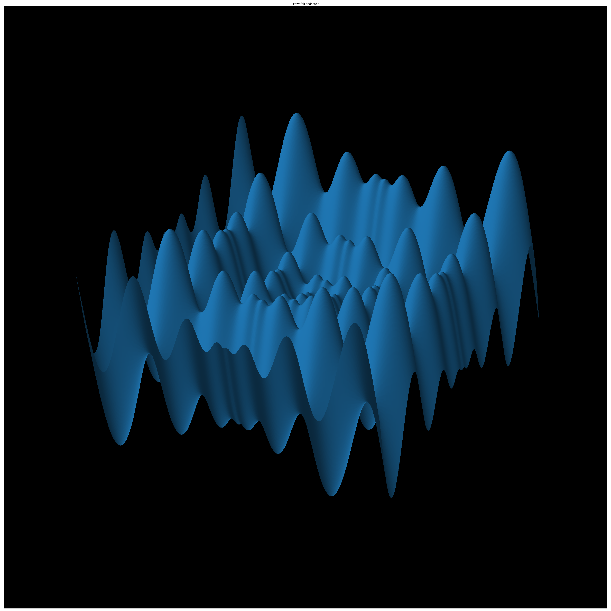

#  Re-imagining Cooperative Co-Evolution: Modular Genetic Algorithms 
Re-written university coursework from my MSc Artificial Intelligence 

# Abstract

Genetic Algorithms are heuristic computer simulations that find parameter configurations in complex search spaces by modelling evolution by artificial selection. Cooperative co-evolution was adapted from nature in 1994 to improve the speed of finding a solution of genetic algorithms by maintaining sub populations with competing specialised individuals. This work shows that the original paper, claiming that co-evolution speeds up the problem, appears to be mainly faster because it decomposes the problem. A modular genetic algorithm is presented that engineers a genome from multiple parents and has the same performance as its co-evolutionary counterpart without maintaining sub populations on the original fitness landscapes. 

# Details
Check out [this post](https://yaron-strauch.com/portfolio/modular-genetic-algorithms) describing the background, methods, and discussion. The code is found [here](code.ipynb).

# License
 This work is licensed under a <a rel="license" href="http://creativecommons.org/licenses/by-nc/4.0/">Creative Commons Attribution-NonCommercial 4.0 International License</a>.